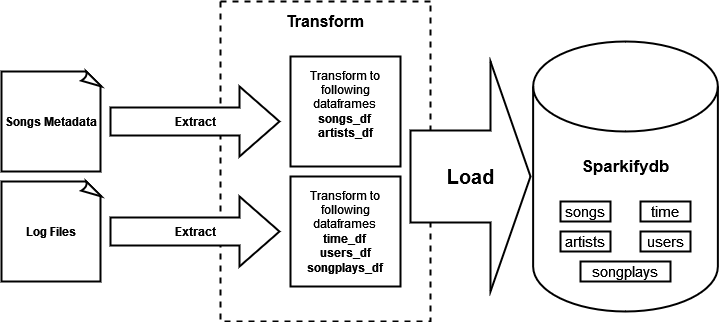

# Sparkify Data Warehouse


## Summary

Sparkify is a startup app that aims to analyze data about songs and user acitivity in the music streaming app. The music data generated from the app resides on directories containing JSON files about the user activity logs and the songs metadata. The purpose of the data datalake is to create an easy way to perform various analytical and ad-hoc queries on the data to continue finding insights into what songs the users are listening to with a consistent view. 
Hence, sparkifydb datalake is created by extracting the various data in the JSON files residing in S3 buckets, performing the appropriate ETL transformations, creating a star schema suitable for analytical queries, and then saving them again in S3 as parquet files, a more appropriate data format where data can be stored with optomization regarding column data types and retrieval speed.

---

## Database Schema Design

<br>


- A star schema is used to fit the OLAP system needs. Tables **songs**, **artists**, **users** and **time** form the dimensional tables. Table **songplays** represents the fact table, all stored as parquet files in the S3 Data Lake.
  <br>
  <br>

---

## ETL Pipeline

<br>




- First, songs and log JSON files are extracted from the s3 bucket and then fit to spark dataframes. 
- Dimensional tables songs' and artists' columns are extracted from the song json files using spark and then stored as parquet files in the desired s3 specified by output_data in the `process_song_data` funciton.
- users and time tables' columns are extracted frtaom the app json logs and appropriate transformation are made to the 'ts' (timestamp field) to create the rest of time table columns, then both of the tables are stored in the s3 bucket as parquet files partitioned by appropriate columns when applicable to improve data retrieval time.
- both songs data and logs data are joined together and then desired columns are extracted to create songplays dataframe which is thereafter partitioned by year and month and stored as parquet file in the s3 bucket.

**Running the ETL file**
```
python etl.py
```
<br>
---

## Example Queries for Song Plays Analysis


        query = "<Any Desired Analytical Query like the following>"
        
        songs_df.createOrReplaceTempView("songs")
        artists_df.createOrReplaceTempView("artists")
        users_df.createOrReplaceTempView("users")
        time_df.createOrReplaceTempView("time")
        songplays_df.createOrReplaceTempView("songplays")
        
        spark.sql(query).show()


- How much a user listens to songs on average per day of the week? Are the average listening time differ depending whether the user is subscribed or not?

        SELECT songplays.user_id, time.weekday, AVG(songs.duration) FROM
        ((songs JOIN songsplays ON
        songs.song_id = songplays.song_id)
        JOIN time ON
        songplays.start_time  = time.start_time)
        GROUP BY
        songplays.user_id, time.weekday, songplays.level;

- Who uses the app more frequently, males or females?

        SELECT users.gender, COUNT(DISTINCT songplays.session_id) FROM songplays JOIN users ON
        users.user_id = songplays.user_id
        GROUP BY users.gender;
        
        
- Number of user conversions from free level to paid level? 

        SELECT SUM(conversion_rate) AS total_conversions FROM 
        (SELECT DISTINCT sp_s.user_id, 
                sp_s.level,
                sp_s.start_time, 
                CASE WHEN sp_s.level='paid' 
                THEN 1 
                ELSE 0 
                END conversion_rate 
                FROM songplays sp_s
                WHERE sp_s.level != (SELECT temp.level FROM songplays temp 
                                            WHERE temp.user_id = sp_s.user_id AND
                                            temp.start_time < sp_s.start_time 
                                     ORDER BY temp.start_time DESC
                                     LIMIT 1))